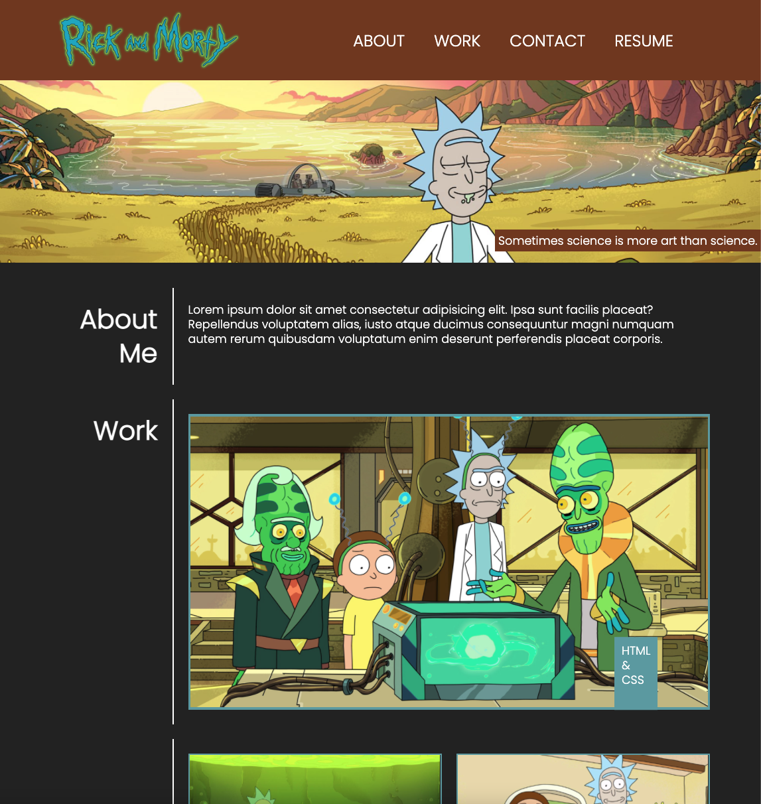
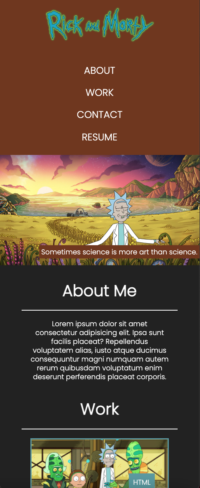

# Rick's Artist Portfolio

## Description 

As a junior developer, if you want to be successful it is important to demonstrate your portfolio online in an engaging and creative way.

This is the beginning of a developer portfolio using placeholder text and images that can reiterated upon and improved as I progress through the remainder of this coding bootcamp. 

Eventually, this will form the foundations of a developing portfolio to use if necessary. 

This aim of this project was a culmination of all the HTML and CSS coding that we have learned previously. It was exciting to see these elements come together and develop the longer that I worked on the project.  

## User Story

```
AS AN employer
I WANT to view a potential employee's deployed portfolio of work samples
SO THAT I can review samples of their work and assess whether they're a good candidate for an open position
```


## Acceptance Criteria

Here are the critical requirements necessary to develop a portfolio that satisfies a typical hiring manager’s needs:

```
GIVEN I need to sample a potential employee's previous work
WHEN I load their portfolio
THEN I am presented with the developer's name, a recent photo or avatar, and links to sections about them, their work, and how to contact them
WHEN I click one of the links in the navigation
THEN the UI scrolls to the corresponding section
WHEN I click on the link to the section about their work
THEN the UI scrolls to a section with titled images of the developer's applications
WHEN I am presented with the developer's first application
THEN that application's image should be larger in size than the others
WHEN I click on the images of the applications
THEN I am taken to that deployed application
WHEN I resize the page or view the site on various screens and devices
THEN I am presented with a responsive layout that adapts to my viewport
```

## Mock Images


